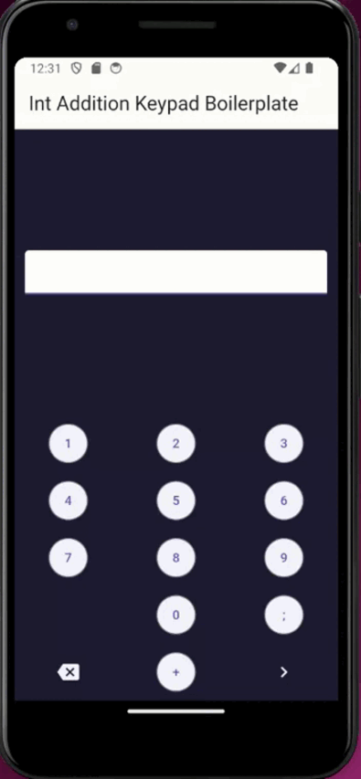

[](https://dart.dev/get-dart#release-channels)
[](https://docs.flutter.dev/get-started/install/linux)
[](https://grpc.io)


UseCase Client Side SetUp
-------------------------

The goal of the project is to show how one can connect 2 or more apps written in different languages thanks to gRPC.

Here, in the client repo, we will be working with only Dart code. Out there,
we will be using from the server side, Python(mainly), Golang or Dart. The server code is in another repo. 

This client project has been managed by:
> - [Espera **Awo**](https://github.com/esperaking81) as the Dart/Flutter tech specialist and adviser.
> - [Vincent **Whannou de Dravo**](https://github.com/de20ce) as the tech lead and the project manager.


## Project Directory Organisation

```
.
├── protos
└── src
    ├── app
    │   ├── android
    │   ├── build
    │   └── lib
    ├── cmd
    │   ├── bin
    │   ├── lib
    │   └── test
    └── usecase
        ├── example
        ├── lib
        └── test

```
The `src` directory contains `3` directories. `app` contains the Flutter apps, i.e the GUI. `cmd` contains the CLI version of the Flutter app, while `usecase` contains the generated stubs from `protos` directory.


# Running the app (GUI) project
The easiest way to run the project within `vscode` is to run it 
by clicling on `Start Debugging` or `Run Without Debugging`from 
`Run` menu.



# Running the cmd project
Go inside `src/cmd/`, and run the following:

```bash
dart run ./bin/cmd.dart
```
 The code that you are testing is in `src/cmd/lib`. As you can notice, you
 can also only test the unary gRPC example by running the folowing:
 ```bash
    dart run bin/cmd.dart --vara 10 --varb 20
 ```

# Credit
https://davidnwaneri.com/building-a-custom-numeric-keypad-in-flutter
https://learn.microsoft.com/en-us/aspnet/core/grpc/performance?view=aspnetcore-8.0
